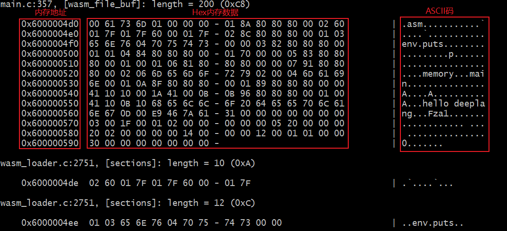

# dump
日志数据或内存数据的格式化输出函数，主要包括dump、debug等。

**示例代码：**

```c
/* 接口示例 */
dump ("wasm_file_buf", wasm_file_buf, wasm_file_size);
debug ("wasm_file_buf size = %d\r\n", wasm_file_size);
```

**示例截图：**



